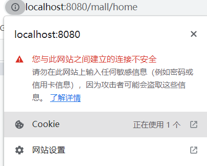
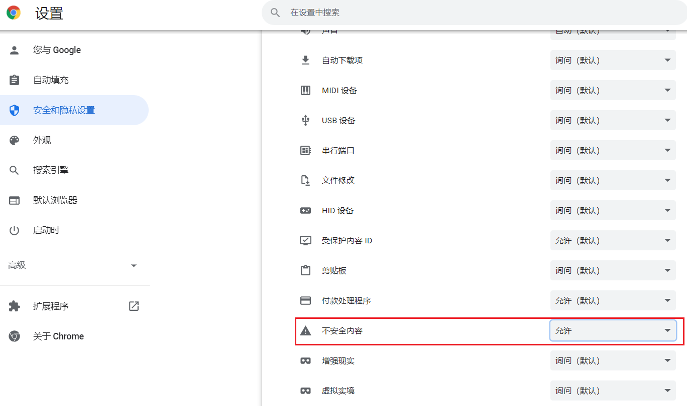
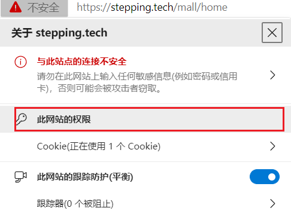
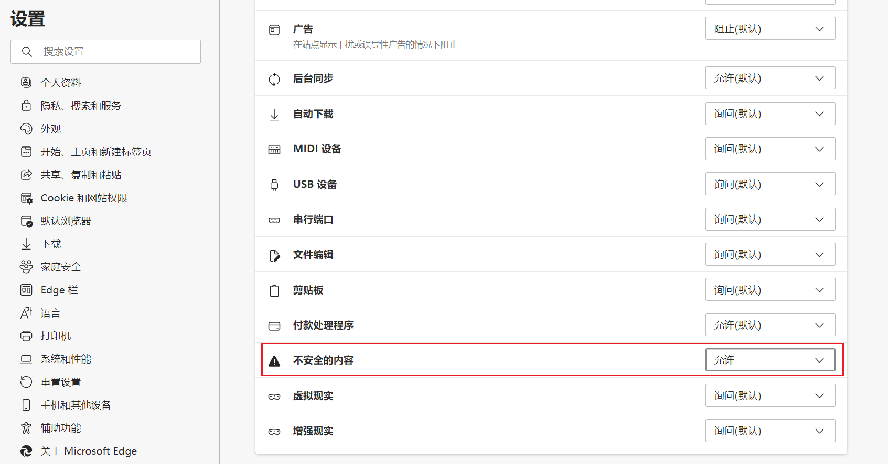

# mall

## 安装
```
npm install
```

## 运行
```
npm run serve
```

## 编译
```
npm run build
```

## 演示地址

https://stepping.tech/mall/

若浏览器显示内容不正常，且控制台报错：`Mixed Content`。原因在于网站使用 https 协议，而后端图片等资源采用 http 协议。

若为 Chrome 浏览器：

1. 点击左上角感叹号图标，打开网站设置。
   
2. 找到下方**不安全内容**，将其设置为允许即可。
   

若为 Edge 浏览器：

1. 点击左上角感叹号图标，打开此网站的权限。
   
2. 找到下方**不安全内容**，将其设置为允许即可。
   